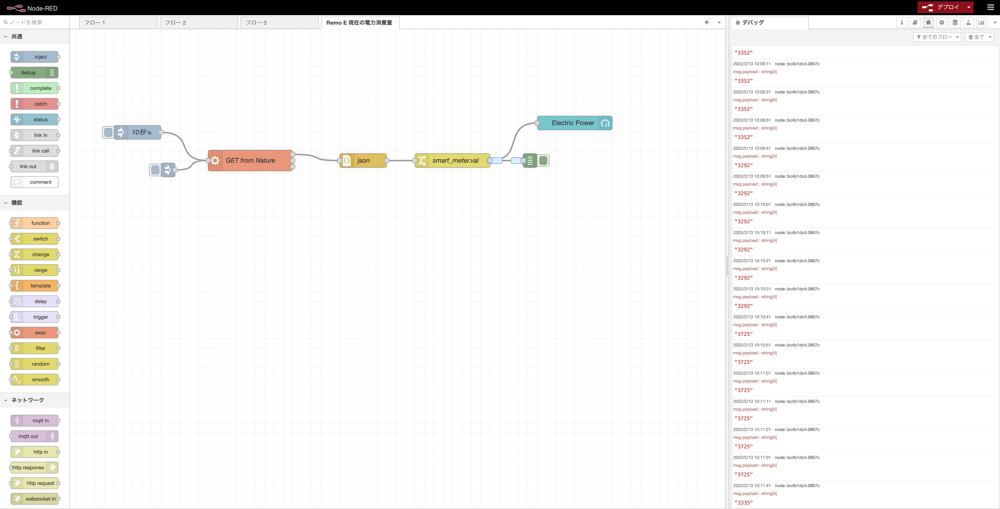

# 電力計測プロジェクト

## ブログ

- [スマートメーターって何？](https://route-b.iij.ad.jp/archives/34)
- [Bルートを利用するまでの流れについて](https://route-b.iij.ad.jp/archives/157)
- [Wi-SUNの規格について](https://route-b.iij.ad.jp/archives/1521)

- [中部電力エリアでスマートメータと通信する方法 (前編)](https://rabbit-note.com/2016/12/23/b-route-service/)

## 商品、サービス

- [Nature Remo E lite](https://nature.global/nature-remo-e-lite/)

## 中部電力パワーグリッド

- [計測データの情報発信（電力メーター情報発信サービス）](https://powergrid.chuden.co.jp/goannai/ippan/smartmeter/use/)

- [スマートメーター導入のチラシ](https://www.chuden.co.jp/resource/seicho_kaihatsu/kaihatsu/techno/techno_naiyou2016/techno_naiyou2016_53.pdf)

## 自力で Nature Remo E の API を叩いてみる

- [Node-REDで『Nature Remo』ノードを使う方法](https://chasuke.com/noderemo/)
    * Remi E でなくて、ただの Remo なので、スマートスピーカーとの接続に使うための用途

- [Nature Remo E liteで、おうちの消費電力を見える化してみた](https://qiita.com/c60evaporator/items/4040040095aa58dcb5b1)
    * これが Remo E のAPIを使う解説で最もよさげ

- [Nature Remo E API](https://developer.nature.global/)

- すごく雑なまとめ
    * [Nature mypage](https://home.nature.global/) でアクセストークンを取得
    * curl -X GET "https://api.nature.global/1/appliances" -k --header "Authorization: Bearer xxxx"
        * 上記のコマンドで、json データを受信
        * xxxx はアクセストークン
    * 受信した json の measured_instantaneous の値が現在の消費電力
    * ただし、アプリが5秒単位に値が変わるのに対し、APIからは１分近く値が更新されない。アプリのAPIは隠されているのでは？

こんな感じになりました

